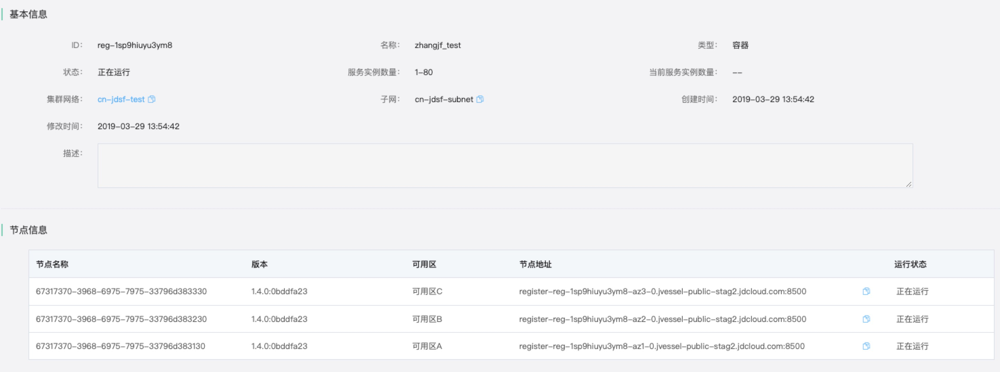
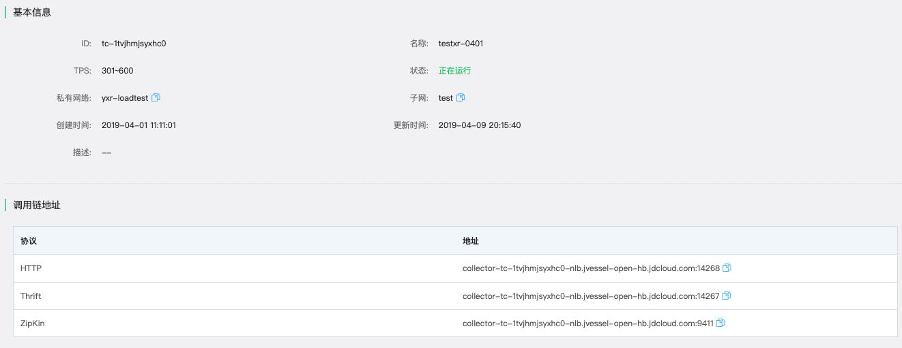

# JDSF Golang Demo

## 项目说明

* 本项目为JDSF Golang demo 项目，主要介绍如何使用京东JDSF框架如何构建一个简单的分布式服务。

## 环境准备

* 安装GoLang SDK,配置好环境变量,如果需要使用 go mod 请安装大于等于 `1.11`版本的 golang 安装包，推荐使用`1.12` ,如果使用老版本请配置好`GOPATH` `GOROOT` 等相应的环境变量。

* 从此github 仓库 clone 代码，如使用不支持 go mod 的版本请将代码放到 `$GOPATH/github.com/jdcloud-cmw/` 下

* 安装自己喜欢的IDE 或者 vim 进行代码编辑

## 项目结构

|- jdsf-demo-client  
|- jdsf-demo-server  
|= image  
|- README.md  
其中jdsf-demo-client为服务的消费者  
jdsf-demo-server 为服无的生产者  
image  文档依赖的图片  
README.md 为此文件
在 项目中 jdsfapi 为进行负载调用以及调用链注册的相关代码，[sling](https://github.com/dghubble/sling) 为 github上的开源项目，本项目在 sling 的基础上进行了扩展，所以直接引用了代码。  
项目中的 conf 文件夹存放了项目的配置  
service 文件夹为项目的启动 和 相关服务的逻辑

## 项目依赖类库说明

项目需要使用 go get 引用响应的依赖库，具体的如下

```shell
go get github.com/opentracing/opentracing-go   # opentracing 调用库
go get github.com/gorilla/mux  #http mux 实现  
go get github.com/google/uuid   #go lang uuid 实现库
go get gopkg.in/yaml.v2   #go yaml 实现库
go get github.com/uber/jaeger-client-go   # jaeger client 实现库
go get github.com/hashicorp/consul/api   # consul api 库
```

## 配置及使用说明

* 配置文件在项目的 conf 目录下的 appConfig.yaml 文件，具体的说明如下：  

```yaml
consul:
  scheme: http  # consul 使用协议
  address: 10.12.209.43 # consul 地址
  port: 8500 #consul 使用端口号
  discover:
    enable: true # 是否使用服务注册发现
    instanceId: go-consul-demo-1 # 服务注册的 instance id
    checkUrl: /api/health/check # 服务的健康检查地址
trace:
  enable: true  # 是否启用调用链
  simpleType: const # 调用链的采集模式
  simpleRate: 1 # 调用链的采集率
  traceHttpAddress: 10.12.140.173 # 调用链地址
  traceHttpPort: 14268 #调用链端口号
app:
  appName: go-consul-demo # 应用名称
  hostIp: 10.12.140.173 # 应用 hostIp
  serverPort: 19200 # 应用的端口号
```

## 代码运行及调试

* 在运行前使用 执行上面 的依赖包引用

* 需要在[京东云](https://www.jdcloud.com)上开通[分布式服务框架](https://www.jdcloud.com/cn/products/jd-distributed-service-framework),目前该中间件服务处于内侧阶段，申请开通服务请[点击此处](https://www.jdcloud.com/cn/public/testApply/jdsf) 进入申请公测页面填写响应的信息，进行公测申请。申请通过以后请按照[分布式服务框架产品文档](https://docs.jdcloud.com/cn/jd-distributed-service-framework/product-overview)介绍分别创建注册中心和调用链分析服务。然后在创建注册中心列表页面点击集群信息，获取注册中心节点地址的地址配置在配置在 demo 的配置文件中的  `consul`->`address` 配置项   
  在调用链分析服务列表页面点击创建的服务名称，进入详细信息页面，然后在页面获取Http 服务地址配置在 demo 的配置文件中的 `trace`->`traceHttpAddress` 属性上， 注意不要写端口号  

* 在文件夹下执行 `go build` 后执行生成的可执行文件（如您使用 windows 或者 mac 而购买的云主机为 linux 操作系统请使用 `GOOS=linux GOARCH=amd64 go build` 进行编译），然后上传到您在京东云购买的和注册中心服务还有调用链分析服务在同一 `VPC` 的云主机上启动并运行

* 在服务server 和 client 启动成功以后再您部署服务的云主机上使用如下命令

```shell
 curl http://localhost:19200/?gameid=123
 ```

调用响应的测试接口然后在调用链分析服务的`依赖图谱` 页面可以看到响应的调用依赖信息，具体的操作请参考[分布式服务框架产品文档](https://docs.jdcloud.com/cn/jd-distributed-service-framework/product-overview)
